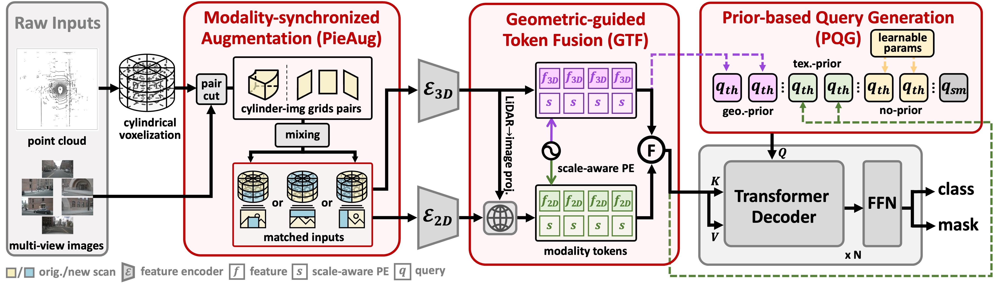
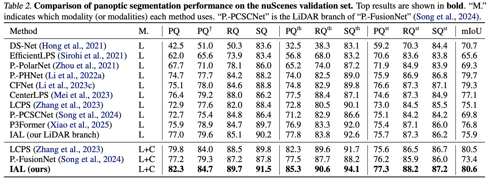

# How Do Images Align and Complement LiDAR? Towards a Harmonized Multi-modal 3D Panoptic Segmentation
*Accepted at ICML 2025*

## Abstract

LiDAR-based 3D panoptic segmentation often struggles with the inherent sparsity of data from LiDAR sensors, making it challenging to accurately recognize distant or small objects. Recently, a few studies have sought to overcome this challenge by integrating LiDAR inputs with camera images, leveraging the rich and dense texture information provided by the latter. 

While these approaches have shown promising results, they still face challenges such as misalignment during data augmentation and reliance on post-processing steps.

To address these issues, we propose **Image-Assists-LiDAR (IAL)**, a novel multi-modal 3D panoptic segmentation framework. In IAL, we first introduce a modality-synchronized data augmentation strategy, **PieAug**, to ensure alignment between LiDAR and image inputs from the start. Next, we adopt a transformer decoder to directly predict panoptic segmentation results.

To effectively fuse LiDAR and image features into tokens for the decoder, we design a **Geometric-guided Token Fusion (GTF)** module. Additionally, we leverage the complementary strengths of each modality as priors for query initialization through a **Prior-based Query Generation (PQG)** module, enhancing the decoder’s ability to generate accurate instance masks. 

Our IAL framework achieves state-of-the-art performance compared to previous multi-modal 3D panoptic segmentation methods on two widely used benchmarks. Code and models are publicly available at [GitHub - IAL](https://github.com/IMPL-Lab/IAL.git).

## Code
The code for this paper will be available **soon**. Stay tuned for updates.

## Framework Diagram
Below is the framework diagram from the paper:

## Main Results

<!-- ## Citation
If you use this work in your own research, please cite the following paper: -->

